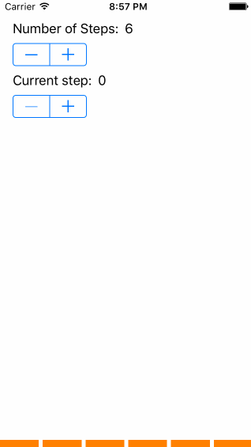

# StepByStep

[](https://travis-ci.org/dadederk/StepByStep)
[](http://cocoapods.org/pods/StepByStep)
[](http://cocoapods.org/pods/StepByStep)
[](http://cocoapods.org/pods/StepByStep)

## Example

To run the example project, clone the repo, and run `pod install` from the Example directory first.

## Requirements
- iOS 8.0+

## Installation

StepByStep is available through [CocoaPods](http://cocoapods.org). To install
it, simply add the following line to your Podfile:

```ruby
pod "StepByStep"
```

## Usage

### Initialisation
To add the stepped progress bar component, just initialise it with a frame and add it to your view:
```
self.stepByStepView = StepByStep(frame: stepByStepViewFrame)
self.view.addSubview(self.stepByStepView)
```

### Customisation
Some customisation that you can do at the moment includes the number of steps and in which step you currently are. The separation between steps and the colour they have.
```
self.stepByStepView.currentStepIndex = 0
self.stepByStepView.numberOfSteps = 5
self.stepByStepView.stepsSeparation = 5.0
self.stepByStepView.stepsColor = UIColor.orangeColor()
```



## Author

Daniel Devesa

[](https://twitter.com/dadederk)

## License

StepByStep is available under the MIT license. See the LICENSE file for more info.
